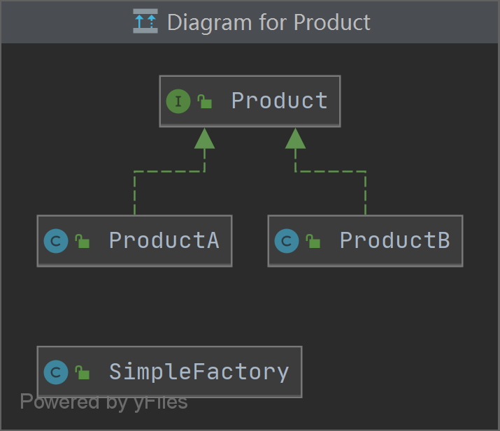
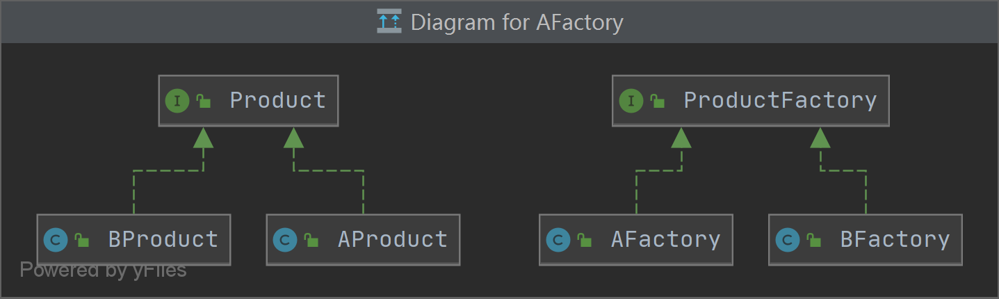
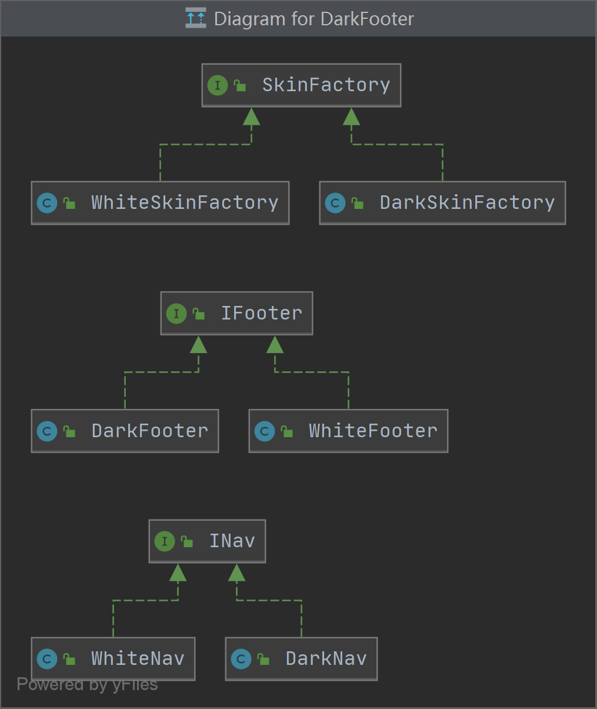

# 工厂模式作业

## 1.用UML绘制出三种工厂模式的类结构图

1. 简单工厂模式

   

2. 工厂模式

   

3. 抽象工厂模式

   

## 2.深刻理解产品族和产品等级结构之间的关系

（1）产品族表示的是同一组类别下的不同事物，例如同一个品牌下的不同产品，同一个软件皮肤下各种不同模块；
（2）产品等级结构表示的是不同类别，例如华为、小米等品牌；
（3）可以有多个产品等级结构，每个产品等级结构下，有各自的产品族；
（4）可以根据产品等级结构获得该结构下的产品族；

## 3.自主完成三种工厂模式的代码实现，理解简单工厂、工厂方法和抽象工厂的区别

### 简单工厂模式

简单工厂类

```java
package com.cgb.java.factory.simple;

public class SimpleFactory {
    public Product getProduct(String name) {
        if("产品A".equals(name)) {
            return new ProductA();
        } else if("产品B".equals(name)) {
            return new ProductB();
        }

        return null;
    }
}

```

产品接口

```java
package com.cgb.java.factory.simple;

public interface Product {
    public String show();
}

```

产品A

```java
package com.cgb.java.factory.simple;

public class ProductA implements Product {
    @Override
    public String show() {
        return "展示产品A";
    }
}

```

产品B

```java
package com.cgb.java.factory.simple;

public class ProductB implements Product {
    @Override
    public String show() {
        return "展示产品B";
    }
}

```

测试类

```java
package test;

import com.cgb.java.factory.simple.SimpleFactory;

public class SimpleFactoryTest {
    public static void main(String[] args) {
        SimpleFactory simpleFactory = new SimpleFactory();
        System.out.println(simpleFactory.getProduct("产品A").show());
        System.out.println(simpleFactory.getProduct("产品B").show());
    }
}

```

### 工厂模式

工厂接口

```java
package com.cgb.java.factory.normal;

public interface ProductFactory {
    public Product getProduct();
}

```

A工厂接口

```java
package com.cgb.java.factory.normal;

public class AFactory implements ProductFactory {
    @Override
    public Product getProduct() {
        return new AProduct();
    }
}

```

B工厂接口

```java
package com.cgb.java.factory.normal;

public class BFactory implements ProductFactory {
    @Override
    public Product getProduct() {
        return new BProduct();
    }
}

```

A产品类

```java
package com.cgb.java.factory.normal;

public class AProduct implements Product {
    @Override
    public String show() {
        return "展示产品A";
    }
}

```

B产品类

```java
package com.cgb.java.factory.normal;

public class BProduct implements Product {
    @Override
    public String show() {
        return "展示产品B";
    }
}

```

测试类

```java
package test;

import com.cgb.java.factory.normal.AFactory;
import com.cgb.java.factory.normal.BFactory;

public class NomalFactoryTest {
    public static void main(String[] args) {
        AFactory aFactory = new AFactory();
        BFactory bFactory = new BFactory();
        System.out.println(aFactory.getProduct().show());
        System.out.println(bFactory.getProduct().show());
    }
}

```


### 抽象工厂模式（换肤场景）

底部样式接口

```java
package com.cgb.java.factory.abstrac;

public interface IFooter {
    String showFooter();
}

```

菜单样式接口

```java
package com.cgb.java.factory.abstrac;

public interface INav {
    String showNav();
}

```

抽象工厂类

```java
package com.cgb.java.factory.abstrac;

public interface SkinFactory {
    IFooter renderFooter();
    INav renderNav();
}

```

白色皮肤底部类

```java
package com.cgb.java.factory.abstrac;

public class WhiteFooter implements IFooter {
    @Override
    public String showFooter() {
        return "渲染白色主题底部";
    }
}

```

白色皮肤菜单类

```java
package com.cgb.java.factory.abstrac;

public class WhiteNav implements INav {
    @Override
    public String showNav() {
        return "渲染白色主题菜单";
    }
}

```

白色皮肤工厂类

```java
package com.cgb.java.factory.abstrac;

public class WhiteSkinFactory implements SkinFactory {
    @Override
    public IFooter renderFooter() {
        return new WhiteFooter();
    }

    @Override
    public INav renderNav() {
        return new WhiteNav();
    }
}

```

黑色皮肤底部类

```java
package com.cgb.java.factory.abstrac;

public class DarkFooter implements IFooter {
    @Override
    public String showFooter() {
        return "渲染黑色主题底部";
    }
}

```

黑色皮肤菜单类

```java
package com.cgb.java.factory.abstrac;

public class DarkNav implements INav {
    @Override
    public String showNav() {
        return "渲染黑色主题菜单";
    }
}

```

黑色皮肤工厂类

```java
package com.cgb.java.factory.abstrac;

public class DarkSkinFactory implements SkinFactory {
    @Override
    public IFooter renderFooter() {
        return new DarkFooter();
    }

    @Override
    public INav renderNav() {
        return new DarkNav();
    }
}

```

测试类

```java
package test;

import com.cgb.java.factory.abstrac.DarkSkinFactory;
import com.cgb.java.factory.abstrac.WhiteSkinFactory;

public class AbstractFactoryTest {
    public static void main(String[] args) {
        DarkSkinFactory darkSkinFactory = new DarkSkinFactory();
        System.out.println(darkSkinFactory.renderFooter().showFooter());
        System.out.println(darkSkinFactory.renderNav().showNav());

        WhiteSkinFactory whiteSkinFactory = new WhiteSkinFactory();
        System.out.println(whiteSkinFactory.renderFooter().showFooter());
        System.out.println(whiteSkinFactory.renderNav().showNav());
    }
}

```

简单工厂模式使用单个工厂类控制产品对象的生成，不适合复杂的业务场景。

工厂模式使用一个工厂接口，多个工厂类实现，控制多种场景的对象生成，适合比简单工厂更复杂的业务场景，但是扩展修改比较困难。

抽象工厂模式，使用抽象工厂类，分别定义产品族和产品登记结构，适用例如多种课程、软件换肤等复杂场景

